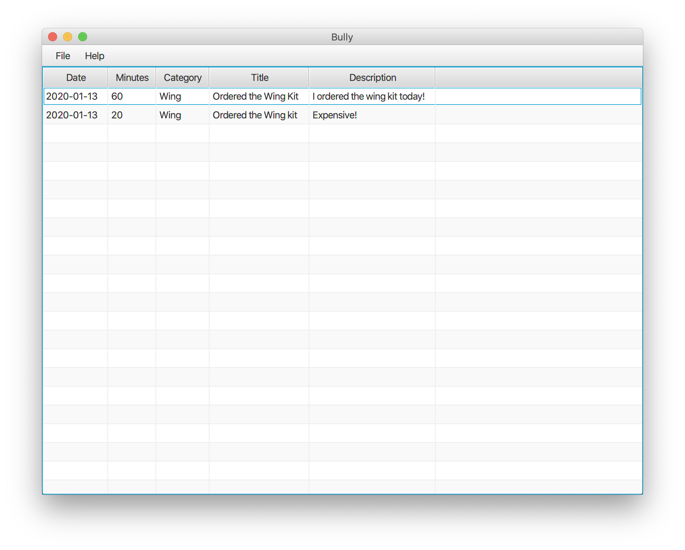

# Bully

## Please note that Bully is not quite ready for a first release!

Bully is an open source tool for logging a build.
'It is primarily intended for experimental aircraft projects,
but could easily be used for other projects where time needs to be tracked
(car restoration, building a house, etc.).

Keep track of hours spent and tag by chapter/section.

##### Please note that I have not fully tested Bully and am not responsible for any problems you might encounter.

##### If you are interested in helping, please let me know.

## FAQ:

#### Q: Why are you doing this?
A: There doesn't seem to be a good tool to do what Bully is supposed to do.
ExperCraft has shut down,
[KitLog](http://www.kitlog.com/ "KitLog") is $50 and really only applicable to airplane projects,
and [AviaLoft](https://www.avialoft.com/ "AviaLoft") has terrible reviews on the app store.
I liked [Todd Osborne's software](http://toddosborne.net/Software.aspx "Todd Osborne's Build Log Tool"), but setup requires issuing `chmod 777`, which you should **never _ever_** do.
I've tried handwritten logs, Excel, and Blogspot.
None of them have worked for me, so I'm working on Bully.

#### Q: Why is this a desktop app? I want to use this on my [insert smartphone here]!
A: I hate typing on my phone.
It's much more comfortable to type large amounts of text on a computer.
I eventually plan to add access to the Google Photos API,
so you will be able to select photos backed up automatically to the cloud.

#### Q: Java sux. Why didn't you use [insert other programming language here]?
A: Java is a great cross-platform language.
Java runs on Windows, Linux, and MacOS.
What's not to like about that?

#### Q: Why are you using JavaFX? [Insert old window framework here] works just as well!
A: My college instructed with Java and the Swing toolkit.
This project was started as an excuse to learn the current framework, which is JavaFX.
I am using the OpenJDK version of Java 8 because it is **much** easier for working with JavaFX.

#### Q: How are you storing the data?
A: Each project will be stored in a sqlite database.
This allows a user to select and back up files as they traditionally would.
It also allows leveraging the power of a database.
[I like databases](https://brownbigdata.github.io/ "Ask me about my research").

#### Q: Where is this going?
A: When you pay for KitLog, they host your build.
I don't like this.
When ExperCraft shut down, a lot of people lost their build logs.
Bully will be able to export the database to a website that you control,
so it can stay online even when development of Bully stops.

#### Q: You're using sqlite databases to store pictures. Why the hell would you do that? What about storing paths to the pictures?
A: Small images are needed for websites, and small images work OK for sqlite databases.
[Please see this article](https://www.sqlite.org/intern-v-extern-blob.html "SQLite blob performance").
It notes that work with small BLOBs is handled faster by SQLite than by disk I/O.
Plus, it's so much easier to back up a project when _everything_ is in the database.

#### Q: Why is the code posted on GitHub, where I can see all of the stuff I don't need to see?
A: You might not be able to poke into the files and understand what's going on (and that's OK!),
but some people can and want to.
If there were something wrong, at least people would be able to see what it is.

#### Q: Why is it not done yet?
A: I'm a grad student.
I work on it over breaks for fun.
I'm doing my best.
If you want it done faster, then you should make a donation 🤑.
Since you've made it this far, you might as well ask if you can help!
